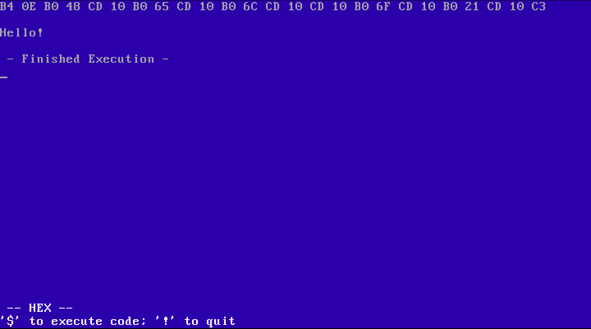
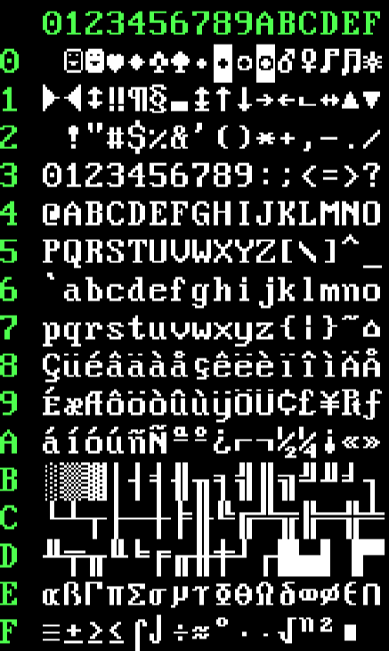

# kern.
---

Idk why i called it that it was 3am and i needed sleep

## About
Kern is a 32-bit OS based on the x86 architecture written in NASM Assembly and C. 
I'm working on a basic command line as well as a custom filesystem (filetable for now).

More info can be found in [The Docs](./docs/main.md)

_Since 32-bit switch, a lot of features have been removed because they were dependent on BIOS interrupts_

## Usage
If you want to try kern for some reason, you can.
You might be able to find some releases, or build it using the build.sh script.

For building, you'll need these tools:
- [NASM](https://www.nasm.us/)
- [GCC](https://gcc.gnu.org/) on linux
- A cross compiler on mac (installation `$ brew tap nativeos/i386-elf-toolchain && brew install i386-elf-binutils i386-elf-gcc`)
- [QEMU](https://www.qemu.org/) (for emulation)

Then just run `./build.sh` and it should build and run qemu.

I personally wouldn't recommend running this on real hardware, because it's untested and will just probably break you pc, but if you really want to, you can try it, but don't blame me if something goes wrong.

If you don't know how to do something, try the 'help' command!

## Some images

Text editor **concept**: \

Available character set: \

Available colors: \

_These images may be outdated, Idk_

## Known issues
- If you run the kernel.bin, loading files sorta breaks, because the program is running at 0x8000, but it thinks that it's at 0x2000 (i think)
- If you run anything in the code editor and return to the kernel, you won't be able to load any files

## [Old Version](https://github.com/Tom-on64/old-kern)
