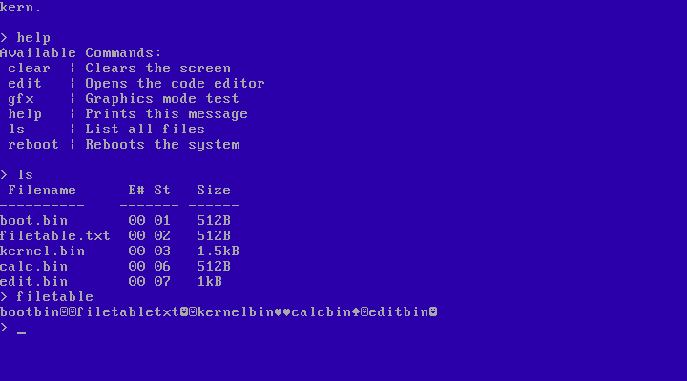
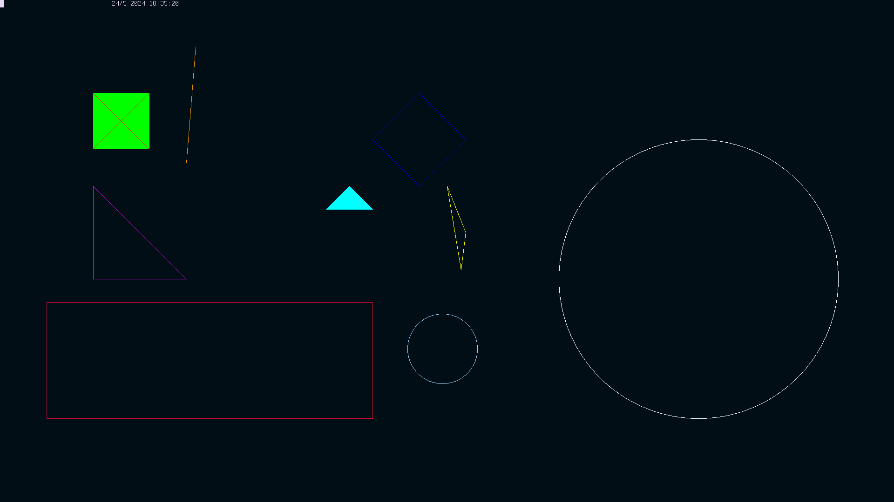

# kern.
---

Idk why i called it that it was 3am and i needed sleep

## About
Kern is a 32-bit OS based on the x86 architecture written in NASM Assembly and C. 

It supports a basic command line and has a custom filesystem.

_Note: The filesystem is currently a basic filetable._

## Usage
If you want to try kern for some reason, you can.
You might be able to find some releases, or build it using the build.sh script.

For building, you'll need these tools:
- [NASM](https://www.nasm.us/)
- [QEMU](https://www.qemu.org/) (for emulation)

I personally wouldn't recommend running this on real hardware, because it's untested and will just probably break you pc, but if you really want to, you can try it, but don't blame me if something goes wrong.

If you don't know how to do something, try the 'help' command!

## Some images

The command prompt: \

Built-in code editor: \

Graphics mode test: \

_These images may be outdated, Idk_

## Known issues
- If you run the kernel.bin, loading files sorta breaks, because the program is running at 0x8000, but it thinks that it's at 0x2000 (i think)
- If you run anything in the code editor and return to the kernel, you won't be able to load any files
- If you type only the starting letters of a command, it will still run (ie. 'he' will run help)
