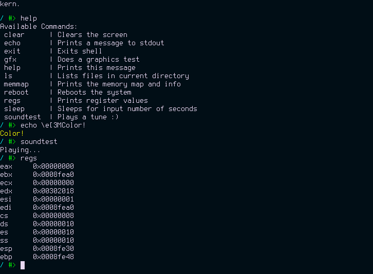
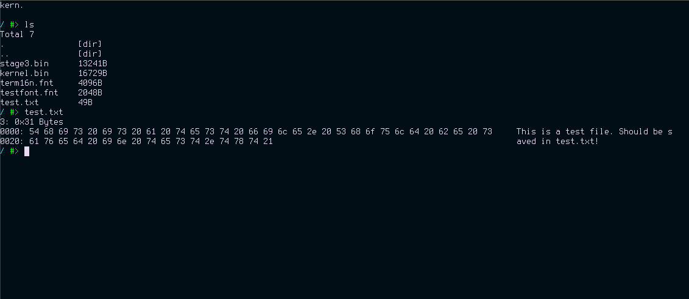

# kern.
---

Idk why i called it that it was 3am and i needed sleep

## About
Kern is a 32-bit OS based on the x86 architecture written in NASM Assembly and C. 
I'm working on a basic command line as well as a custom filesystem (filetable for now).
It has a simple shell with some commands. (Use 'help' for a list of available ones)

Since there's always more to do, here are the [todos](todo.txt).

### Features
- Filesystem (filetable)
- Interactive Shell
- Disk I/O
- Font support (funky format)
- 1920x1080 Resolution, 32bpp
- Physical memory manager

## Building & Running
If you want to try kern for some reason, you can.

### Tools
- [NASM](https://www.nasm.us/)
- [QEMU](https://www.qemu.org/) (for emulation)

**Unix Like Systems**
- [GCC](https://gcc.gnu.org/)

**On MacOS**
- A cross compiler: `$ brew tap nativeos/i386-elf-toolchain && brew install i386-elf-binutils i386-elf-gcc`

### Commands
```bash
$ make # Or 'make os'
$ make run # Run QEMU
```

_I personally wouldn't recommend running this on real hardware, because it's untested and will just probably break you pc, but if you really want to, you can try it, but don't blame me if something goes wrong._

## Some images

Interactive Shell: \


Filesystem: \


Disk R/W: \


_These images may be outdated, Idk_

## Known issues
- If you run kernel.bin from shell, it will clear the memory map so when you load anything it will override the kernel code

## [Old Version](https://github.com/Tom-on64/old-kern)

